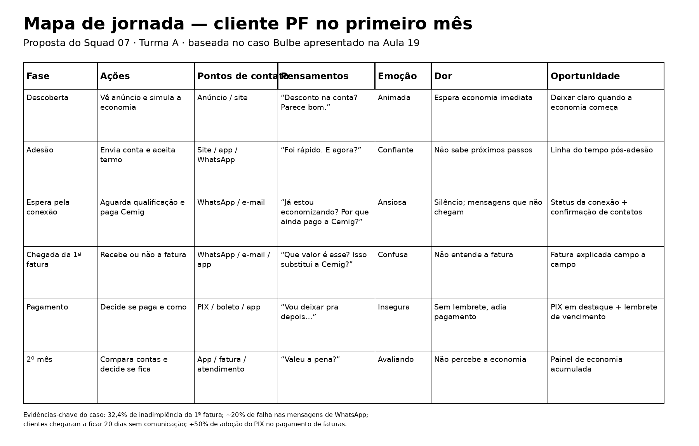

# Mapa de jornada do usuário

> Entregável da Aula 19 · Squad 07 · Turma A

## Persona 1: Marina

- **Nome e idade:** Marina, 38 anos
- **Contexto:** cliente pessoa física no primeiro mês; aderiu pelo celular após ver um anúncio no Instagram e paga cerca de R$ 280 de luz por mês.
- **Objetivo:** pagar menos pela energia, sem dor de cabeça e sem mudar a rotina.
- **Medos e dúvidas:** “Isso é golpe?”, “Vou pagar duas contas?” e “E se a fatura não chegar?”.
- **Canais que usa:** WhatsApp durante o dia; quase não abre e-mail e ainda não baixou o app.

## Persona 2: Sergio
- **Nome e idade:** Sérgio Almeida, 56 anos. Mora em Minas Gerais, em casa própria, e a conta de luz está no nome da esposa.
- **Contexto:** Usa o celular quase só para WhatsApp e ligações, e raramente instala aplicativos. Um colega de trabalho contou no almoço que a conta de luz dele caiu depois que entrou na Bulbe e mandou o link pelo WhatsApp. Sérgio baixou o app, tocou em "Quero economizar" e preencheu o cadastro com o colega ao lado. Como a conta não é dele, precisou pedir o CPF da esposa e fotografar a conta de papel da Cemig, o que levou várias tentativas. Aceitou os termos sem ler, porque confia no colega. Terminou o cadastro esperando que a conta já viesse menor no mês seguinte, sem saber que o desconto pode levar até 90 dias.
- **Objetivo:** Pagar menos na conta de luz de casa sem complicação, sabendo exatamente quanto pagar e onde pagar, de preferência do jeito que já está acostumado (boleto). Também quer poder mostrar à esposa que a economia veio e que não foi enganado.
- **Medos e dúvidas:**
  - "Fiz tudo no celular, mas e agora? Não chegou nada dizendo que deu certo."
  - "Meu colega disse que a conta diminui, mas veio igual. Será que eu fiz alguma coisa errada?"
  - "Chegaram duas contas, a da Cemig barata e a da Bulbe cara. Qual eu pago? Se eu pagar só uma, vão cortar a nossa luz?"
  - "Dei o CPF da minha esposa e a foto da conta. Se for golpe, a culpa é minha."
- **Canais que usa:** WhatsApp (principal, com áudios e mensagens), ligação telefônica, conversa pessoal com o colega que indicou, a conta de papel que chega da Cemig, e boleto pago no banco ou na lotérica. Quase não usa e-mail e só mexe no app da Bulbe com ajuda da filha ou do colega.
## Persona 3: Mariana
Persona: Mariana Silva, 26 anos.

Contexto: Designer gráfica, mora num apartamento alugado e faz questão de consumir de empresas sustentáveis. Descobriu a Bulbe pelas redes sociais enquanto procurava formas de usar energia limpa sem precisar de instalar painéis solares no teto do prédio.

Objetivo: Contratar energia solar de forma totalmente online, rápida e sem burocracia, ajudando o meio ambiente e economizando na conta de luz.

Medos e dúvidas:

“Será que o contrato de fidelidade vai me impedir de cancelar o serviço caso eu decida mudar de apartamento no próximo ano?”
“Quanto tempo demora o processo de adesão até eu começar a receber os descontos na conta de luz?”
“Será que a economia na conta de energia realmente compensa o tempo gasto com o cadastro?”
Canais utilizados: Utiliza principalmente Instagram, WhatsApp e e-mail, realizando a maioria das suas atividades pelo celular. Prefere processos totalmente digitais, evitando documentos em papel, e costuma realizar seus pagamentos por PIX ou débito automático.

## Persona 4: Carlos Eduardo

Contexto: É engenheiro civil, mora com a esposa e dois filhos e é o responsável por pagar todas as contas da casa. Conheceu a Bulbe por um anúncio online sobre redução de custos na conta de luz. Quer organizar o orçamento familiar, mas tem receio de processos burocráticos.

Objetivo: Pagar menos na conta de energia do apartamento e conseguir acompanhar mês a mês se a economia prometida está realmente acontecendo de forma transparente.

Medos e dúvidas:

"Será que vou ter que pagar duas faturas separadas todo mês?"

"E se no inverno o consumo mudar, o desconto continua valendo a pena?"

"Se houver algum problema na distribuição, a culpa é da Bulbe ou da concessionária?"

Canais que usa: E-mail para assuntos financeiros, WhatsApp para comunicação rápida, computador do trabalho e aplicativo do banco no celular para pagamentos por PIX.

## Persona 5: Maria

- **Nome e idade:** Dona Maria, 68 anos.
- **Contexto:** Aposentada, mora sozinha e vive com uma renda fixa. Sua filha indicou a Bulbe Energia para ajudá-la a economizar na conta de luz, mas Maria tem pouca familiaridade com tecnologia e receio de cair em golpes digitais.
- **Objetivo:** Reduzir o valor da conta de luz sem precisar aprender a utilizar aplicativos complexos ou mudar sua rotina de pagamento.
- **Medos e dúvidas:**
  - "Isso não é um golpe para tirarem dinheiro da minha aposentadoria?"
  - "Se eu não conseguir abrir o documento no celular, como vou saber o valor que tenho que pagar?"
  - "Posso continuar pagando o boleto na lotérica como sempre fiz?"
- **Canais que usa:** WhatsApp, principalmente mensagens de áudio e texto, ligações telefônicas e boletos impressos, pagos na lotérica ou no caixa do banco.

## Mapa

| Fase | Ações | Pontos de contato | Pensamentos | Emoção | Dor (com evidência da Bulbe) | Oportunidade |
| --- | --- | --- | --- | --- | --- | --- |
| Descoberta | Vê anúncio e simula a economia | Anúncio, site, landing page | “Desconto na conta de luz? Parece bom.” | Animada | Espera economia imediata | Deixar claro quando a economia começa |
| Adesão | Envia a conta de luz e aceita o termo | Site/app, WhatsApp | “Foi rápido. E agora?” | Confiante | Não sabe quais são os próximos passos | Linha do tempo pós-adesão |
| Espera pela conexão | Aguarda a qualificação e continua pagando a Cemig | WhatsApp, e-mail | “Já estou economizando? Por que ainda pago a Cemig?” | Ansiosa | Silêncio e mensagens que não chegam; clientes chegaram a ficar 20 dias sem comunicação | Status da conexão e confirmação de contatos |
| Chegada da 1ª fatura | Recebe (ou não) a 1ª fatura da Bulbe | WhatsApp, e-mail, app | “Que valor é esse? Isso substitui a Cemig?” | Confusa | Cerca de 20% das mensagens de WhatsApp falham e a fatura antiga tinha pouca transparência | Fatura explicada campo a campo |
| Pagamento | Decide se paga e como | PIX, boleto, app | “Vou deixar pra depois…” | Insegura | Sem lembrete, adia o pagamento | PIX em destaque e lembrete de vencimento |
| 2º mês | Compara as contas e decide se fica | App, fatura, atendimento | “Valeu a pena?” | Avaliando | Não percebe a economia | Painel de economia acumulada |

## Oportunidades prioritárias do Squad 07

### 1. Status da conexão e confirmação de contatos

**Problema:** o cliente pode ficar sem sinal de que o processo está andando e algumas mensagens não chegam.

**Evidências:** clientes chegaram a ficar 20 dias sem comunicação; cerca de 20% das mensagens de WhatsApp falham.

**Oportunidade:** criar uma forma clara de acompanhar o status da conexão e confirmar os canais de contato.

### 2. Fatura explicada campo a campo

**Problema:** o cliente pode não entender o que está sendo cobrado na primeira fatura.

**Evidência:** a apresentação informa que a fatura antiga tinha pouca transparência de custos e não mostrava com clareza a economia gerada pela Bulbe.

**Oportunidade:** apresentar os principais campos, valores e explicações da primeira fatura em linguagem simples.

### 3. PIX em destaque e lembrete de vencimento

**Problema:** sem lembrete e sem um caminho simples, o pagamento pode ser adiado e virar atraso.

**Evidência:** a apresentação informa mais de 50% de adoção do PIX no pagamento de faturas.

**Oportunidade:** deixar o PIX evidente e facilitar o pagamento próximo ao vencimento.

## Oportunidades registradas como Issues

- [ ] Oportunidade 1 — Status da conexão e confirmação de contatos
- [ ] Oportunidade 2 — Fatura explicada campo a campo
- [ ] Oportunidade 3 — PIX em destaque e lembrete de vencimento

## Próximo passo

Na Aula 20, transformar as oportunidades em histórias de usuário e critérios de aceite. Para a Turma A, a Aula 20 está prevista para 07/10/2026.
